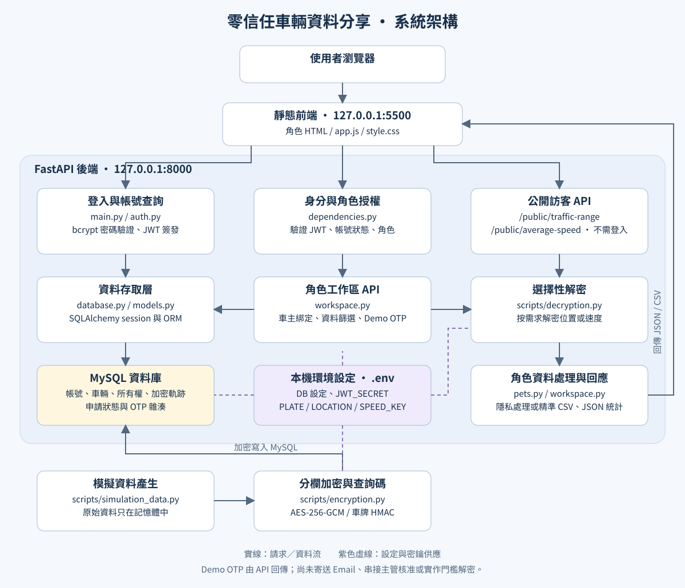

# 零信任車輛資料分享

本專案包含前端登入介面、FastAPI 後端、MySQL 資料庫，以及車輛軌跡模擬程式。

後端套件、登入流程、JWT、bcrypt、SQLAlchemy、ORM 與 API 架構的詳細說明請閱讀：

- [後端套件與登入流程說明](docs/backend-packages.md)

## 專案資料夾架構

```text
Zero-Trust-Vehicle-Data-Sharing-with-Threshold-Decryption/
├── frontend/                 # 靜態網頁，由瀏覽器呼叫 API
│   ├── login.html            # 登入與公開訪客入口
│   ├── index.html            # 登入後依角色導頁
│   ├── owner.html / visitor.html / vendor.html
│   ├── supervisor_a.html / supervisor_b.html
│   ├── admin.html / researcher.html / police.html
│   ├── app.js                # 登入、查詢、OTP 與 CSV 下載
│   └── style.css             # 共用樣式
├── backend/                  # FastAPI API 與資料存取
│   ├── main.py               # 應用程式、CORS、登入與帳號查詢 API
│   ├── auth.py               # bcrypt 密碼驗證與 JWT 簽發／驗證
│   ├── dependencies.py       # 資料庫 session、目前使用者與角色授權
│   ├── database.py           # .env 載入、MySQL engine 與 session
│   ├── models.py             # 六張資料表的 ORM 定義
│   ├── schemas.py            # 帳號與登入回應格式
│   ├── workspace.py          # 公開統計、角色查詢與 Demo OTP API
│   ├── migrations/           # 既有資料表結構調整 SQL
│   ├── requirements.txt      # Python 套件版本
│   ├── .env.example          # 可提交的設定範本
│   ├── .env                  # 本機設定與秘密，不提交
│   └── README.md             # 後端詳細說明
├── scripts/                  # 建表、模擬與資料保護工具
│   ├── create_table.py        # 只建立缺少的資料表
│   ├── simulation_data.py     # 模擬車輛並寫入加密資料
│   ├── main.py                # 另一個模擬資料執行入口
│   ├── encryption.py          # AES-GCM、金鑰初始化與車牌 HMAC
│   ├── decryption.py          # 依欄位解密
│   ├── pets.py                # 軌跡去頭尾、偏移、假名與時間粗化
│   └── README.md              # 工具詳細說明
├── docs/
│   ├── backend-packages.md    # 後端套件與登入流程說明
│   └── images/system-architecture.svg # 系統架構圖
├── .gitignore
├── .demo-accounts.json        # 本機測試帳號密碼，不提交
└── README.md
```

`frontend/` 負責畫面與送出請求；`backend/` 負責驗證、授權與資料庫存取；`scripts/` 同時提供命令列工具及後端使用的加解密、PETs 函式。`.env`、`.demo-accounts.json` 與 `.venv/` 都是本機檔案，clone 後需另外準備。

## 系統架構圖



[開啟完整架構圖](docs/images/system-architecture.svg)

登入憑證存於瀏覽器本分頁的 `sessionStorage`；受保護 API 每次都從資料庫重新確認帳號狀態與角色。車主查詢另檢查所有權綁定，公開統計不需要 JWT。資料庫保存分欄密文，後端在記憶體中解密、處理後回傳 JSON 或 CSV。

OTP 目前是 Demo：API 直接回傳六位數碼，驗證後輸出指定範圍的精準資料；沒有 Email 寄送或實際主管核准流程。專案名稱包含 Threshold Decryption，但目前實作是三把獨立 AES 金鑰與角色授權，尚未實作門檻解密。

## 1. Clone 後安裝 Python 3.11 與專案套件

本專案使用 Python 3.11。`.venv/` 是每位開發者在自己電腦建立的虛擬環境，不會提交到 GitHub。若 Ubuntu 內建的是其他 Python 版本，可用 `uv` 安裝獨立的 Python 3.11，不會更改系統 Python。

先安裝 Git、curl 與 MySQL Server（若尚未安裝）：

```bash
sudo apt update
sudo apt install git curl mysql-server
```

從 GitHub 取得專案並進入資料夾：

```bash
git clone <GitHub repository URL>
cd Zero-Trust-Vehicle-Data-Sharing-with-Threshold-Decryption
```

安裝 `uv`，並讓目前的 Bash 終端機找到它：

```bash
curl -LsSf https://astral.sh/uv/install.sh -o /tmp/uv-installer.sh
sh /tmp/uv-installer.sh
source "$HOME/.local/bin/env"
```

使用 `uv` 安裝 Python 3.11，並建立包含 pip 的虛擬環境：

```bash
uv python install 3.11
uv venv --seed --python 3.11 .venv
source .venv/bin/activate
```

安裝 Python 套件：

```bash
python --version
python -m pip install --upgrade pip
python -m pip install -r backend/requirements.txt
```

`python --version` 應顯示 Python 3.11.x。安裝過程若出現錯誤，先確認使用的是虛擬環境中的 Python：

```bash
which python
```

路徑應指向專案的 `.venv/bin/python`。往後每次開啟新的終端機，都在專案根目錄重新執行：

```bash
source .venv/bin/activate
```

若先前留下建立失敗的 `.venv`，先確認其中沒有要保留的資料，再移除並重建：

```bash
rm -r .venv
uv venv --seed --python 3.11 .venv
source .venv/bin/activate
python -m pip install -r backend/requirements.txt
```

Python 版本管理說明可參考 [uv 官方 Python 安裝文件](https://docs.astral.sh/uv/guides/install-python/)。

## 2. 建立環境設定

每位開發者需要建立自己的設定檔：

```bash
cp backend/.env.example backend/.env
python -c 'import secrets; print(secrets.token_urlsafe(48))'
```

編輯 `backend/.env`，填入自己的 MySQL 密碼，並將指令產生的隨機值填入 `JWT_SECRET`。`backend/.env` 含有秘密且已被 Git 忽略，不可提交。

初始化三把 AES-256-GCM 金鑰（已存在的值不會被覆蓋）：

```bash
python scripts/encryption.py --init-keys
```

`PLATE_KEY`、`LOCATION_KEY`、`SPEED_KEY` 必須是 Base64 編碼、解碼後各為 32 bytes。保留與既有資料相符的金鑰；任意更換會使原有密文無法解密，變更 `PLATE_KEY` 也會改變車牌查詢碼。修改 `.env` 後請停止並重新啟動後端，`--reload` 不保證重新載入設定檔。

預設資料庫設定為：

```dotenv
DB_HOST=127.0.0.1
DB_PORT=3306
DB_NAME=vehicle_data_sharing
DB_USER=vehicle_app
```

## 3. 建立 MySQL Database 與專用帳號

進入 MySQL：

```bash
sudo mysql
```

在 MySQL 中執行以下 SQL，將密碼替換成 `backend/.env` 的 `DB_PASSWORD`：

```sql
CREATE DATABASE IF NOT EXISTS vehicle_data_sharing
CHARACTER SET utf8mb4
COLLATE utf8mb4_unicode_ci;

CREATE USER IF NOT EXISTS 'vehicle_app'@'127.0.0.1'
IDENTIFIED BY '替換成你的 DB_PASSWORD';

ALTER USER 'vehicle_app'@'127.0.0.1'
IDENTIFIED BY '替換成你的 DB_PASSWORD';

GRANT SELECT, INSERT, UPDATE, DELETE, CREATE, INDEX, REFERENCES
ON vehicle_data_sharing.*
TO 'vehicle_app'@'127.0.0.1';

EXIT;
```

測試後端是否能使用 `.env` 連線：

```bash
source .venv/bin/activate
python -m backend.database
```

成功時會顯示：

```text
MySQL connection succeeded.
```

## 4. 啟動 FastAPI 後端

先在專案根目錄建立缺少的資料表：

```bash
source .venv/bin/activate
python scripts/create_table.py
```

建表入口統一放在 `scripts/create_table.py`，使用 `backend/.env` 的資料庫設定。
六張資料表的結構統一定義在 `backend/models.py`，建表腳本只負責執行建立。
腳本可重複執行，不會刪除資料，也不會變更既有欄位；欄位變更仍需 migration。

在專案根目錄執行：

```bash
source .venv/bin/activate
python -m uvicorn backend.main:app --host 127.0.0.1 --port 8000 --reload
```

FastAPI 啟動時不再自動建立資料表。開啟 API 文件：

```text
http://127.0.0.1:8000/docs
```

目前沒有 `POST /auth/register`；登入帳號需預先建立於 `users`，密碼需以 `backend/auth.py` 的 `hash_password()` 產生 bcrypt 雜湊。公開訪客不需帳號。`POST /auth/login` 接收表單格式的 username 與 password；`GET /auth/me` 需要 Bearer JWT，`GET /users` 與 `GET /users/lookup` 僅允許 admin。停止後端時在終端機按 `Ctrl+C`。

## 5. 執行車輛模擬資料

確認虛擬環境、`backend/.env` 與 MySQL 連線都已設定完成後，在專案根目錄執行：

```bash
source .venv/bin/activate
python scripts/simulation_data.py
```

預設模擬 10 台車、2 天資料，車輛代碼為 `V00000`～`V00009`。重複執行會在交易中取代這批車輛先前的加密軌跡，不是單純追加。模擬程式先將車輛識別碼、位置與速度加密，再透過 `backend/database.py` 使用 `DB_NAME` 指定的資料庫，將結果寫入 `encrypted_trajectories`。`vehicles` 只保存不透明內部 ID 與 HMAC 查詢碼，不保存解密後的車牌。

可進入 MySQL 確認資料：

```bash
sudo mysql
```

```sql
USE vehicle_data_sharing;
SHOW TABLES;
SELECT id, plate_lookup, timestamp FROM encrypted_trajectories LIMIT 10;
SELECT COUNT(*) FROM encrypted_trajectories;
```

## 6. 啟動前端

在專案根目錄執行：

```bash
python3 -m http.server 5500 --bind 127.0.0.1 --directory frontend
```

接著在瀏覽器開啟：

```text
http://127.0.0.1:5500/login.html
```

登入成功後進入 `index.html` 導向頁，由 `GET /auth/me` 驗證 JWT 與身份後前往各自的 HTML 工作區。每個工作區也會驗證身份，身份不符時導向自己的頁面；登出會清除本分頁的登入憑證。

### Windows 瀏覽器存取 VirtualBox 中的服務

上面的 `127.0.0.1` 啟動方式適用於瀏覽器與服務位於同一台機器的情況。若服務在 Linux 虛擬機、瀏覽器在 Windows 主機，請在虛擬機的兩個終端機分別執行：

```bash
.venv/bin/python -m uvicorn backend.main:app --host 0.0.0.0 --port 8000 --reload
```

```bash
.venv/bin/python -m http.server 5500 --bind 0.0.0.0 --directory frontend
```

使用 VirtualBox NAT 網路時，在虛擬機的「設定 → 網路 → NAT 介面 → 進階 → 連接埠轉送」建立兩條 TCP 規則：

| 用途 | 主機 IP | 主機連接埠 | 客體 IP | 客體連接埠 |
| --- | --- | --- | --- | --- |
| 前端 | `127.0.0.1` | `5500` | 留空（預設 NAT 客體） | `5500` |
| 後端 | `127.0.0.1` | `8000` | 留空（預設 NAT 客體） | `8000` |

接著在 Windows 瀏覽器開啟 `http://127.0.0.1:5500/login.html`。前端的 `API_BASE` 使用 `http://127.0.0.1:8000`，所以兩個連接埠都必須轉送，且主機連接埠需使用表中的值。`0.0.0.0` 是服務監聽位址，瀏覽器仍使用主機的 `127.0.0.1`。

若無法連線，先確認兩個服務終端機仍在執行，再確認轉送規則。頁面缺少樣式或停在「等待 JavaScript 載入」時，在 Windows 瀏覽器直接開啟 `http://127.0.0.1:5500/style.css` 和 `http://127.0.0.1:5500/app.js`，確認可取得檔案，並按 `Ctrl + Shift + R` 強制重新整理。若頁面可開啟但登入或查詢無法連線，另開 `http://127.0.0.1:8000/docs` 檢查後端。

### 模擬資料寫入流程

```text
scripts/simulation_data.py
        ↓
scripts/encryption.py
        ↓
backend/database.py
        ↓
MySQL
        ↓
vehicle_data_sharing.encrypted_trajectories
```

## 7. 公開訪客與七種登入身份

訪客不需要帳號或密碼，可從登入頁的「訪客」入口查看公開平均速度。其他身份使用本機測試帳號；帳號及密碼不隨 Git 提交，其他開發者 clone 專案後不會自動取得這些帳號。建立與驗證腳本已移除，`scripts/create_table.py` 只負責建表，不建立帳號。

密碼已隨機產生，儲存在專案根目錄的 `.demo-accounts.json`（僅本機使用，已被 Git 忽略）。每個帳號均使用自己的密碼；登入時填 username。

公開訪客頁位於 `frontend/visitor.html`；登入身份的介面分別位於 `frontend/owner.html`、`vendor.html`、`supervisor_a.html`、`supervisor_b.html`、`admin.html`、`researcher.html`、`police.html`。`index.html` 只負責登入後導頁，`app.js` 處理公開訪客查詢與登入身份驗證。

登入身份呼叫 `/auth/login` 與 `/auth/me` 驗證身份，角色頁會呼叫 `/workspace` 載入工作區基本資料。公開訪客頁不建立 session，只呼叫公開的時間範圍與平均速度 API。

| 身份 | 測試帳號 | 目前功能 |
| --- | --- | --- |
| 車主 | `demo_owner` | 輸入本人綁定車牌與選填時間，下載模糊位置或模糊速度 CSV |
| 訪客 | 不需帳號 | 選擇時間後只顯示所有車輛的整體平均速度 |
| 合作廠商 | `demo_vendor` | 依車牌與時間下載模糊位置或精準速度 CSV；Demo OTP 驗證後下載精準位置 |
| 主管 A | `demo_supervisor_a` | 依車牌與時間下載精準位置 CSV；Demo OTP 驗證後下載精準速度 |
| 主管 B | `demo_supervisor_b` | 依車牌與時間下載精準速度 CSV；Demo OTP 驗證後下載精準位置 |
| 系統管理者 | `demo_admin` | 帳號查詢、會員／車輛／身分數、模糊資料 CSV 與精準資料 Demo OTP |
| 交通研究者 | `demo_researcher` | 依時間下載經 PETs 處理的研究 CSV，不提供車牌篩選 |
| 警方 | `demo_police` | 模糊資料按鈕仍為展示；精準位置／速度 Demo OTP 與 CSV 下載已串接 |

操作方式：開啟 `http://127.0.0.1:5500/login.html`；訪客直接點選「訪客」，其他身份輸入測試帳號。車主可下載本人綁定車輛的模糊位置或速度 CSV；公開訪客只能查詢整體平均速度，沒有下載功能。

後端每次受保護請求都重新查詢帳號角色及啟用狀態。訪客不建立帳號，公開註冊 API 已移除。

此版本使用三把獨立的 AES-256-GCM 金鑰分欄保護車牌、位置與速度。授權設計不採用門檻解密或主管 A、B 共同重建金鑰：主管 A 負責精準位置的授權，主管 B 負責精準速度的授權，兩種資料各自驗證，不要求兩位主管同時同意。警方可依車牌與時間分別申請精準位置或精準速度 Demo OTP，驗證後下載對應 CSV；目前原始 OTP 仍由 API 回傳，尚未寄送 Email。資料筆數少時，彙總值仍不等同匿名化保證。

交通統計及每日分析使用 `encrypted_trajectories`，後端只在記憶體中解密計算所需欄位。車主使用 `GET /workspace/trajectories` 輸入車牌；後端計算 `plate_lookup`、檢查 `vehicle_ownerships`，再查詢加密軌跡。時間條件可省略，若提供則包含起訖端點且不帶時區。位置 CSV 會在記憶體副本中切分行程，每趟首尾至少移除 200～500 公尺及 1 分鐘；每趟行程的經緯度分別使用由伺服器密鑰穩定產生、介於 `±0.0005°` 的固定偏移，使近似軌跡保留相對移動且不公開上下限。時間篩選在 PETs 處理後才套用。速度 CSV 採 10 km/h 區間（不含上限）。處理過程不會回寫或修改 `encrypted_trajectories`。資料申請使用 `data_requests`，OTP 驗證狀態使用只保存雜湊的 `otp_challenges`。六張資料表統一定義於 `backend/models.py`，由 `scripts/create_table.py` 建立。

合作廠商使用 `GET /workspace/vendor/trajectories` 依車牌與必填時間範圍下載資料。位置 CSV 套用與車主分離的固定 PETs 偏移並去除行程首尾；速度 CSV 回傳解密後的精準速度。兩種 CSV 都不包含車牌、`plate_lookup` 或密文。右側查詢下載與左側 Demo OTP 都已串接，但右側查詢尚未強制連結資料使用申請或實際主管核准。

合作廠商左側已提供 OTP 模擬：建立位置申請時產生六位數 OTP，資料庫只暫存同時綁定車牌與時間範圍的 HMAC-SHA256 雜湊、五分鐘期限與錯誤次數。驗證成功會立即下載核准條件的精準位置 CSV 並刪除 OTP 紀錄；過期或達到錯誤上限的 OTP 也會在存取時清除。Demo 期間 API 會回傳原始 OTP 供本機輸入測試，目前尚未寄送 Email。

主管 A 使用 `GET /workspace/supervisor-a/locations` 依車牌與必填時間範圍下載精準位置 CSV。端點只允許 `supervisor_a`，並且只解密位置；CSV 不包含車牌、`plate_lookup`、速度或密文。

主管 A 左側已提供精準速度 OTP 模擬。OTP 雜湊綁定車牌與時間範圍，五分鐘內最多嘗試五次；驗證成功後立即下載精準速度 CSV 並刪除 OTP 紀錄，過期或達到錯誤上限時也會在存取時清除。Demo 期間 API 會回傳原始 OTP 供本機測試，目前尚未寄送 Email。

主管 B 使用 `GET /workspace/supervisor-b/speeds` 依車牌與必填時間範圍下載精準速度 CSV。端點只允許 `supervisor_b`，並且只解密速度；CSV 不包含車牌、`plate_lookup`、位置或密文。

主管 B 左側已提供精準位置 OTP 模擬。OTP 雜湊綁定車牌與時間範圍，五分鐘內最多嘗試五次；驗證成功後立即下載精準位置 CSV 並刪除 OTP 紀錄，過期或達到錯誤上限時也會在存取時清除。Demo 期間 API 會回傳原始 OTP 供本機測試，目前尚未寄送 Email。

系統管理者使用 `GET /workspace/admin/trajectories` 依必填時間與車牌篩選資料，可另加完整速度範圍。後端解密後套用速度條件，再輸出已去除行程首尾的模糊位置與 10 km/h 速度區間 CSV；CSV 不包含車牌、`plate_lookup`、精準位置、精準速度或密文。

系統管理者的 OTP 申請可選精準位置或精準速度，車牌必填，時間範圍選填。未填時間時使用該車目前完整資料時間；查不到可下載資料時回傳錯誤，不產生空 CSV。Demo OTP 綁定資料類型及申請範圍，五分鐘有效、最多錯誤五次，驗證成功即下載對應精準 CSV 並刪除 OTP 紀錄。此版本仍由 API 回傳 Demo OTP，尚未寄送 Email 或串接主管核准。

交通研究者使用 `GET /workspace/researcher/trajectories` 依必填時間範圍下載研究 CSV。後端先對完整資料套用 `apply_researcher_pets()`，包含行程首尾去除、假名與靜默期、位置偏移、降低頻率、`coarsen_time()` 時間粗化及速度取整，再依時間範圍輸出；不提供車牌查詢或精準欄位。


## 8. 車主綁定與資料表

模擬腳本會登記車輛與加密軌跡，但不會建立帳號或自動綁定車主。車主必須在 `vehicle_ownerships` 中有對應紀錄才可下載資料。

| 資料表 | 用途 |
| --- | --- |
| `users` | 帳號、bcrypt 密碼雜湊、角色與啟用狀態 |
| `vehicles` | 不透明 `vehicle_id` 與車牌 HMAC `plate_lookup` |
| `vehicle_ownerships` | 車主帳號 ID 與 `vehicles.vehicle_id` 的綁定 |
| `encrypted_trajectories` | 車牌／位置／速度密文、查詢碼及明文時間 |
| `data_requests` | 資料使用申請與決策狀態 |
| `otp_challenges` | OTP 雜湊、有效期限與驗證次數 |

前端輸入的是模擬車牌，例如 `V00000`；綁定表的 `vehicle_id` 必須使用 `vehicles` 中的內部 ID，不能直接填入 `V00000`。可在專案根目錄唯讀查出待綁定車輛的內部 ID：

```bash
python - <<'PYCODE'
from sqlalchemy import select
from backend.database import SessionLocal
from backend.models import Vehicle
from scripts.encryption import make_plate_lookup

with SessionLocal() as db:
    vehicle_id = db.scalar(
        select(Vehicle.vehicle_id).where(
            Vehicle.plate_lookup == make_plate_lookup("V00000")
        )
    )
    print(vehicle_id or "找不到車輛，請先確認模擬資料與金鑰")
PYCODE
```

確認車主帳號與車輛後，再由資料庫管理者建立綁定。既有舊綁定需要遷移到同一輛車的內部 ID；`create_all()` 不會自動修正舊資料或外鍵。目前 `migrations/001_add_researcher_police.sql` 僅擴充角色 enum，需以具有 `ALTER` 權限的帳號執行，並不處理車輛綁定遷移。

## 9. 常見問題

| 現象 | 檢查與處理 |
| --- | --- |
| API 回傳 500，出現 `Table ... doesn't exist` | 執行 `python scripts/create_table.py` 補齊缺少的表 |
| 登入正常，但資料查詢解密失敗 | 確認三把 AES 金鑰與寫入時相同；修改 `.env` 後重啟後端 |
| 車主查詢回傳 403 | 確認帳號啟用、角色為 owner，且所有權綁定使用目前的內部車輛 ID |
| 沒有可查詢時間或資料 | 確認已初始化金鑰、建表並執行模擬腳本；時間使用資料庫中的模擬期間 |
| 登入回傳 401 | 使用 username 與原始密碼，確認帳號存在且已啟用 |
| OTP 驗證失敗 | 使用本次申請的六位數碼及原車牌、時間與資料類型；五分鐘有效，最多錯誤五次 |

公開平均速度先依車輛計算平均，再計算各車平均的平均值；範圍內不足三輛車時回傳 `null`。這個門檻不代表已實作差分隱私。現有角色 HTML 的部分提示仍保留「介面展示」或「尚未串接」文字，實際串接狀態以本 README 功能表與 `app.js` 的事件處理為準。
